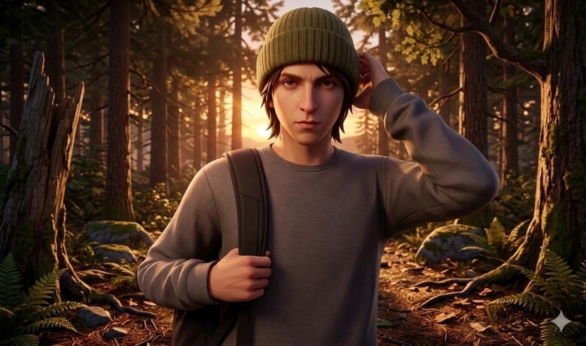
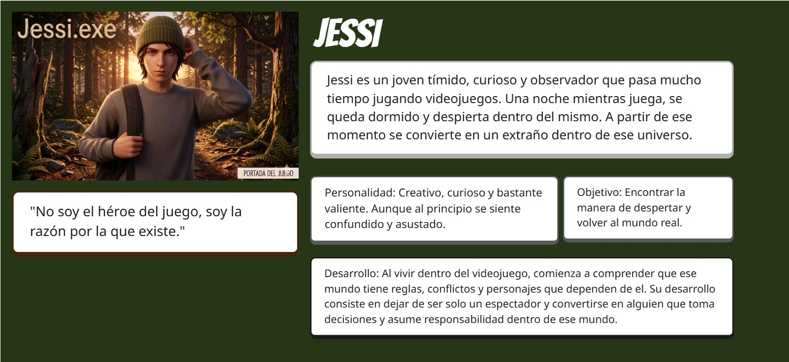
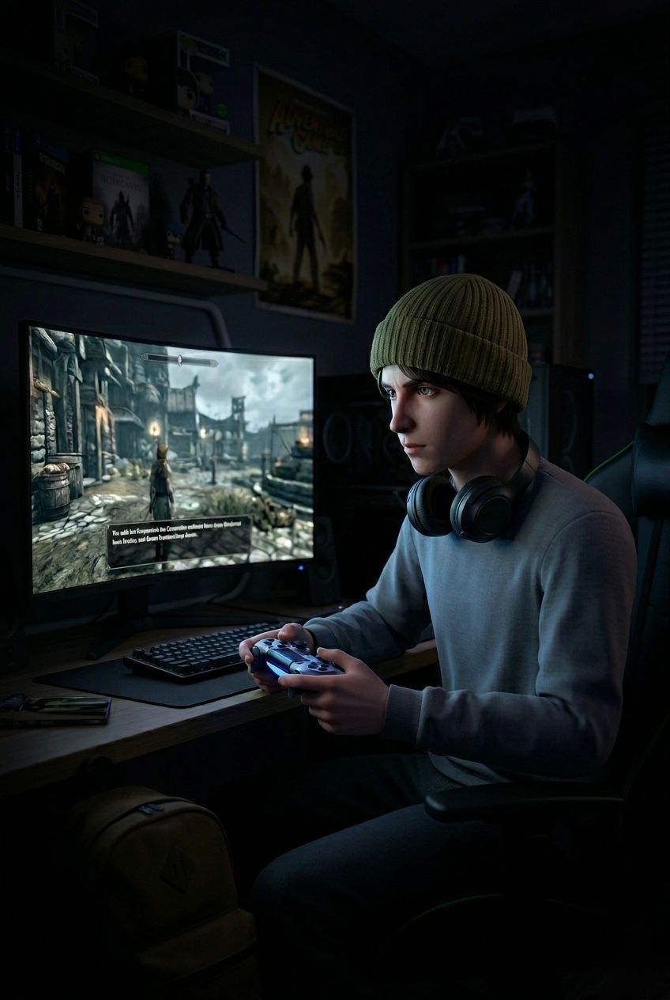

# Proyecto Jessi.exe: 
### Jessi.exe
Plantilla para crear mi historia interactiva de la asignatura [Creatividad e innovación Audiovisual](https://www.ugr.es/estudiantes/grados/grado-comunicacion-audiovisual/creacion-difusion-nuevos-contenidos-audiovis), repositorio de proyectos y documentación en https://github.com/mgea/storytelling

Autores:  
<!---
Incluir lista de personas del grupo 
Se puede añadir enlace a página personal de github o lo que se quiera...(optativo)
-->

- :trollface: Rebeca Fernández Bahena
- :star: María Silvana Molina León 

Proyecto (código): 
URL (link) del proyecto en Github: https://github.com/Rebecush/Jessy.exe/tree/main

Tipo/Género:  
- [x] FictionCiberpunk  
- [ ] Reality/tribus urbanas  
- [ ] Comic

## Resumen
Jessi, un chico obsesionado con los videojuegos, se queda dormido mientras juega y despierta dentro de este mismo. Lo que al principio parece emocionante pronto se vuelve inquietante: el juego está lleno de errores, espacios vacíos y personajes que actúan de forma extraña. Atrapado sin saber cómo salir, Jessi descubre que ya no tiene el control como jugador, sino que ahora forma parte del juego. Mientras intenta encontrar una salida, comienza a cuestionar qué es real y si realmente podrá volver a su vida. Al vivir dentro del videojuego, comienza a comprender que ese mundo tiene reglas, conflictos y personajes que dependen de el. Su desarrollo consiste en dejar de ser solo un espectador y convertirse en alguien que toma decisiones y asume responsabilidad dentro de ese mundo.

### Personaje
-JESSI 

Nuestro protagonista es creativo, curioso y bastante valiente cuando se trata de descubrir cosas nuevas. Aunque al principio se siente confundido y asustado, su curiosidad lo impulsa a explorar el mundo del juego. También tiene un lado empático, lo que hace que conecte con los personajes del juego y quiera ayudarles, incluso cuando eso significa arriesgarse.

### Historia
Cuando una noche jessi se queda dormido mientras juega un videojuego despierta en un mundo diferente al suyo, frente a sus ojos algo no encaja. Lo confirma cuando un personaje del juego, que antes solo repetía frases, lo mira directamente y le dice:

“No deberías estar aquí”.

Jessi entiende que no es un jugador más, sino algo distinto, algo que no debería existir ahí. Descubre los recuerdos de su vida real mezclados con escenarios del juego. Fragmentos de su pasado flotan en ese mundo. Es ahí cuando empieza a comprender que es un juego construido con partes de su propia mente.

Entonces se enfrenta a una decisión imposible: quedarse y perderse para siempre en ese mundo, o despertar y destruirlo. Sin embargo, encuentra una tercera opción. 
Divide su memoria en fragmentos y los esconde dentro del juego, como una forma de dejarse a sí mismo dentro del universo, sin desaparecer por completo.

### TagLine
Para despertar, tendrá que dejar atrás el mundo que creó… o quedarse y olvidarse de quién es para siempre. 

### Conflicto 

Jessi está atrapado en un mundo que depende de el para existir, y debe decidir entre regresar a su realidad o quedarse y preservar ese universo, sabiendo que cualquiera de las dos opciones implica perder una parte de sí mismo.

### Productos

- Personaje:
  

ENLACE: (https://app.lumi.education/run/ML7-oT)

### Conclusiones/Valoración del equipo

Esta practica nos hizo ejercer nuestra creatividad a un punto sin limites, de igual forma construir un personaje desde cero con la lluvia de ideas de nuestros compañeros y desarrollar esa narrativa para poder atrapar al público. En general valoramos esta actividad como muy útil y entretenida, como tambien complicada por los diversos medios como el test interactivo o la exportación de nuevos archivos pero fue algo que aprendimos sobre la marcha. Fue muy satisfactorio aprender de nuevas técnicas de creatividad para poder darle vida a esta historia. 

------

<!---
Lista completa de emojis de markDown - https://gist.github.com/rxaviers/7360908) 
-->

Febrero, 202X

Proyecto dentro de la serie [Narrativas interactivas](https://github.com/mgea/storytelling/blob/master/What_is_a_digital_storytelling.md) 
Proyectos seleccionados de [2023](https://github.com/mgea/storytelling/tree/master/2023), [2022](https://github.com/mgea/storytelling/blob/master/2022/readme.md) / [2021](https://github.com/mgea/storytelling/blob/master/2021/readme.md) / [2020](https://github.com/mgea/storytelling/blob/master/2020/readme.md)  / 
[2019](https://github.com/mgea/storytelling/blob/master/2019/readme.md) / [2018](https://github.com/mgea/storytelling/blob/master/2018/readme.md) 

CC BYNCSA [Creatividad e Innovación Audiovisual-B](https://github.com/mgea/criav/)

 

[Facultad de Comunicación y Documentación](http://fcd.ugr.es)

Universidad de Granada
